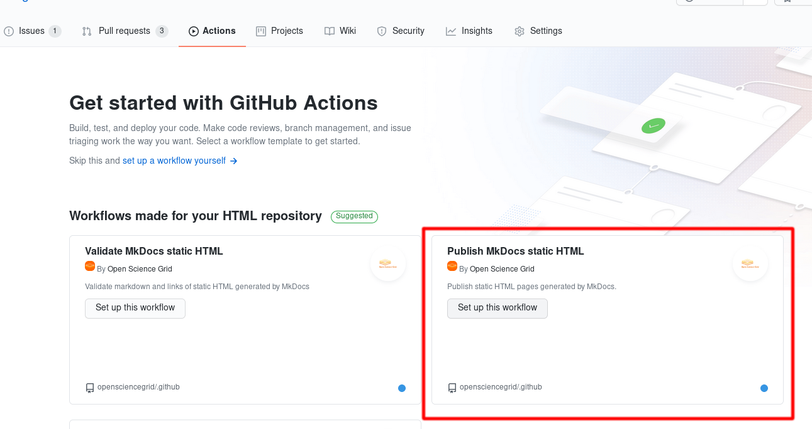
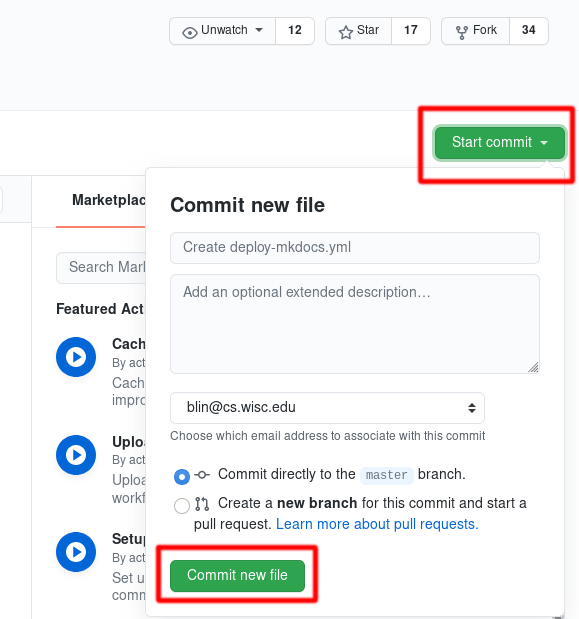
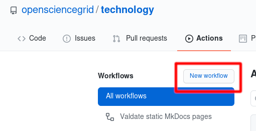

Publishing OSG Pages with MkDocs
================================

The OSG uses [MkDocs](https://www.mkdocs.org/) for [site documentation](https://osg-htc.org/docs/) and
team-specific web pages (e.g. <https://osg-htc.org/technology/>).
This document contains instructions for creating a new OSG area through GitHub and transitioning an existing MkDocs
GitHub repository from [Travis CI](https://travis-ci.com/) to [GitHub Actions](https://github.com/features/actions).

Creating New Pages
------------------

!!! help "Need assistance?"
    If you need any assistance with setting up your GitHub repository, please reach out to <help@opensciencegrid.org>.

This document assumes that you are an administrator of the `opensciencegrid` GitHub organization.
Before starting, make sure that you have the `git` and `gem` tools installed.

1. Create a new public repository in the [opensciencegrid organization](https://github.com/organizations/opensciencegrid/repositories/new)
   (referred to as `<REPO NAME>` in the rest of this document)

    1. Check the box marked `Initialize this repository with a README`

1. Identify the repository as using mkdocs:

    1. On the repository home page (i.e., `https://github.com/opensciencegrid/<REPO NAME>`), click the gear button in
       the top right (next to "About")
    1. In the topics field, add `mkdocs`
    1. Click the “Save Changes” button

1. Clone the repository and `cd` into the directory:

        git clone https://github.com/opensciencegrid/<REPO NAME>.git
        cd <REPO NAME>

1. Create a `gh-pages` branch in the GitHub repository:

        git push origin main:gh-pages

1. Update the contents of `README.md` and populate the `LICENSE` file with a
   [Creative Commons Attribution 4.0 license](https://creativecommons.org/licenses/by/4.0/legalcode.txt):

        wget https://creativecommons.org/licenses/by/4.0/legalcode.txt > LICENSE

1. Create and encrypt the repository deploy key

    1. Generate the repository deploy key:

            ssh-keygen -t rsa -b 4096 -C "help@opensciencegrid.org" -f deploy-key -N ''

    1. Install the `travis` gem:

            gem install travis

    1. Login using your GitHub credentials:

            travis login --com

    1. Enable the repository in Travis:

            travis enable --com -r opensciencegrid/<REPO NAME>

    1. Encrypt the deploy key and temporarily save the output (you will need the hashes later for `.travis.env`):

            travis encrypt-file --com deploy-key

    1. Stage and commit your files:

            git add LICENSE README.md deploy-key.enc
            git commit -m "Prepare the repository for Travis-CI deployment"

        !!! danger
            Do NOT commit the unencrypted `deploy-key`!

    1. Add the contents of `deploy-key.pub` to your repository's list of
       [deploy keys](https://docs.github.com/en/developers/overview/managing-deploy-keys#deploy-keys).
       Make sure to check `Allow write access`.

1. Follow [these instructions](https://github.com/opensciencegrid/doc-ci-scripts#travis-ci-documentation-scripts) to add
   the `doc-ci-scripts` sub-module

   Use the `mkdocs-v1` branch of the `doc-ci-scripts` submodule.

1. Create `mkdocs.yml` containing the following:

        site_name: <TITLE OF YOUR SITE>
        site_url: https://osg-htc.org/<REPO NAME>
        repo_name: https://github.com/osg-htc/<REPO NAME>
        theme:
          name: material

        nav:
          - Home: 'index.md'

        markdown_extensions:
          - admonition
          - codehilite:
              guess_lang: False
          - meta
          - toc:
              permalink: True

1. Create a `docs` directory containing an `index.md` that will be your home page.

1. Stage and commit these changes:

        git add mkdocs.yml docs/index.md
        git commit -m "Staging initial web page contents"

1. Push local changes to the GitHub repository:

        git push origin main

    Your documents should be shortly available at `https://www.opensciencegrid.org/<REPO NAME>`

1. Contact <help@opensciencegrid.org> to request repository backups to UW-Madison.

Creating an ITB Area
--------------------

This section describes creating an ITB repository for a documentation area created in the [previous section](#creating-new-pages)

1. Create a new repository in the [opensciencegrid organization](https://github.com/organizations/opensciencegrid/repositories/new) and name it `<REPO NAME>-itb`.
   For example, an ITB area for the `docs` repository has a repository name of `docs-itb`.
   The ITB repository will be referred to as `<ITB REPO NAME>` in the rest of this document.

    1. Check the box marked `Initialize this repository with a README`
    1. Once created, add the `mkdocs` topic by clicking on the "Add topics" button

1. Clone the repository and `cd` into the directory:

        git clone git@github.com:opensciencegrid/<ITB REPO NAME>
        cd <ITB REPO NAME>

1. Create a `gh-pages` branch in the GitHub repository:

        git push origin main:gh-pages

1. Update the contents of `README.md`
1. In the non-ITB repository, create and encrypt the ITB repository deploy key

    1. `cd` into the non-ITB repository and generate the ITB deploy key

            cd <REPO NAME>
            ssh-keygen -t rsa -b 4096 -C "help@opensciencegrid.org" -f deploy-itb

    1. Install the `travis` gem:

            gem install travis

    1. Encrypt the deploy key:

            travis encrypt-file deploy-itb

    1. Update `.travis.env` with the appropriate ITB values
    1. Add and commit your files:

            git add .travis.env deploy-itb.enc
            git commit -m "Add ITB deployment"

        !!! danger
            Do NOT commit the unencrypted `deploy-itb`!

1. Add `deploy-itb.pub` to the **ITB** repository's list of [deploy keys](https://docs.github.com/en/developers/overview/managing-deploy-keys#deploy-keys).
   Make sure to check `Allow write access`.
1. Still in the non-ITB repository, push your local changes to the GitHub repository

        git push origin main

    Your documents should be shortly available at `https://www.opensciencegrid.org/<REPO NAME>`

Transitioning to GitHub Actions
-------------------------------

!!! help "Need assistance?"
    If you need any assistance with transitioning your repository to GitHub actions, please reach out to
    <help@opensciencegrid.org>.

When originally developed, OSG MkDocs repositories were set up to automatically publish web page changes through
[Travis CI](https://travis-ci.com/).
But in November 2020, Travis CI changed their pricing model so we are moving the automatic publishing infrastructure
to GitHub Actions and using this opportunity to also upgrade the version of MkDocs.

To ensure that your pages continue to be autmoatically published you will need to prepare your repository for the new
version of MkDocs, disable Travis CI, and enable GitHub Actions.

### Preparing the repository ###

Before upgrading, you must fix the following incompatibilities:

-   Rename the `pages:` section of `mkdocs.yml` to `nav:`.
    The section contents are identical; only the name is changing.

-   Update all of the [links](style-guide.md#links) in the documents as follows:

    -  Ensure links end in `.md`
    -  Ensure links are document-relative, not site-relative

    For example, links should be of the form `../software/development-process.md` instead of
    `/software/development-process`.

-   Push your changes to your fork and [create a pull request](https://docs.github.com/en/pull-requests/collaborating-with-pull-requests/proposing-changes-to-your-work-with-pull-requests/creating-a-pull-request-from-a-fork)

!!! tip "Previewing your pages with Docker"

    If you would like to ensure the correctness of your fixes, run the following command:

        :::console
        docker run -it -v ${PWD}/docs -p 8000:8000 squidfunk/mkdocs-material:6.1.4

    After running this command, enter `localhost:8000` in your browser to preview your pages.
    Saved changes made to `.md` files are automatically updated in your browser!

### Disabling Travis CI ###

After you've prepared your repository for the transition, disable Travis CI by removing related files from it.
Perform the following actions from the command-line:

1.  Create a fresh clone of the repository that is still using Travis CI:

        :::console
        git clone https://github.com/opensciencegrid/<GIT REPOSITORY>

    !!! important
        For the rest of the steps in this documentation to work, you should create a new clone of the repository using
        the above command, even if you already have an existing copy!

1.  `cd` into the directory containing the repository (should be the same as `<GIT REPOSITORY>` by default)

1.  Remove all of the Travs CI related files:

        :::console
        git rm ci
        git rm .travis.env deploy-key.enc .travis.yml

1.  Commit your changes:

        :::console
        git commit -am "Disable Travis CI"

1.  Push your changes (you will be prompted for your GitHub credentials):

        :::console
        git push origin master

### Enabling GitHub Actions ###

The new method for validating and publishing OSG pages for a MkDocs repository can be enabled entirely through the
[GitHub web interface](https://docs.github.com/en/actions/using-workflows/sharing-workflows-secrets-and-runners-with-your-organization#using-a-workflow-template):

1.  Navigate to the `opensciencegrid` fork of the GitHub repository in your web browser,
    e.g. <https://github.com/opensciencegrid/docs/>

1.  Click on the `Actions` tab:

    

1.  Find the `Publish MkDocs static HTML` workflow by the Open Science Grid and click the `Set up this workflow` button:

    

1.  Click on the `Start commit` drop-down button then click `Commit new file`:

    

1.  Navigate to the `Actions` tab to verify your transition.
    If you see green check marks, your pages are now being published with GitHub Actions!

1.  **(Optional)** Enable the `Validate MkDocs Static HTML` workflow to check for broken links and markdown correctness
    of pull requests to the repository.

    1.  Navigate to the `Actions` tab as before

    1.  Click on the `New Workflow` button:

        

    1.  Find the `Validate MkDocs static HTML` workflow by the Open Science Grid and click `Set up this workflow`

    1.  As before, click on the `Start commit` drop-down button then click `Commit new file`
