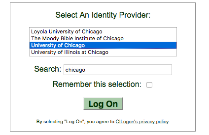

title: User Certificates

User Certificates
=================

!!! note
    This document describes how to get and set up a **personal** certificate (also called a grid user certificate).
    For instructions on how to get **host** certificates, see the [Host Certificates document](https://osg-htc.org/docs/security/host-certs/overview/).

Getting a User Certificate
--------------------------

This section describes how to get and set up a personal (user) certificate.
A user certificate is a type of SSL certificate -- the same technology used for identifying websites when using HTTPS
-- but identifying a human instead of a host.

This is used to access some grid resources, such as:

-   [OSG Topology](https://topology.opensciencegrid.org) (for viewing private contact information)
-   The `osg-notify` tool for sending mass emails
-   The [GGUS ticketing system](https://ggus.eu)
-   The [Koji build system](https://koji.opensciencegrid.org) for the OSG Software Stack

User certs may also be useful for debugging storage access (such as XRootD).

Currently, you can get a user certificate from CILogon.

### Know your responsibilities

If your account or user certificate is compromised, you **must** notify the issuer of your certificate. 
In addition, you should update your certificate and revoke the old certificate if any of the information in the
certificate (such as name or email address) change.
For the CILogon RA send email to [ca@cilogon.org](mailto:ca@cilogon.org).
Additional responsibilities required by the CILogon CA are given on [their page](http://ca.cilogon.org/responsibilities).  

### Getting a certificate from CILogon

You will have to obtain your user certificate using the [CILogon web UI](https://cilogon.org/).
Follow the steps below to get an user certificate:

1. Open the CILogon page, <https://cilogon.org>, in your browser of choice
1. First, either search for your institution and select it or scroll through list and do the same.

    .

    !!! warning
        Do not use Google, GitHub, or ORCID as providers since they are not widely supported in the OSG.
        If your institution is not on the list, please contact your institution's IT support to see if they can support
        CILogon.

1. Click the `Log On` button and enter your institutional credentials if prompted.
1. After successfully entering your credentials, click on the "Create Password-Protected Certificate" link
1. Enter a password that is at least 12 characters long and then click on the `Get New Certificate` button.
1. Click the `Download Your Certificate` button to download your certificate in `.p12` format.
   The certificate will be protected using the password you entered in the previous step.

### Certificate formats

Your user certificate can be stored in a few different formats:

CILogon will give you a certificate in the [PKCS12](https://en.wikipedia.org/wiki/PKCS_12) format (file extension `.p12`).
The PKCS12 format stores the certificate and private key in a single file along with an optional certificate chain.
This is the file format that can be loaded into your browser for accessing Topology, GGUS, or the Koji web interace with.

Most command line tools use the [PEM](https://en.wikipedia.org/wiki/Privacy-Enhanced_Mail) format (file extension `.pem`).
The PEM format stores the public certificate in one file, and the private key in another file.

To convert a PKCS12 file to PEM files, do the following:

1.  First, extract your user certificate from your PKCS12 file by running the following command.
    You'll be prompted for the password you used to create the certificate.
    The invocation assumes that the PKCS12 file is called `usercred.p12`.
    After running, the PEM certificate will be written to `usercert.pem`.

        :::console
        user@host $ openssl pkcs12 -in usercred.p12 -out usercert.pem -nodes -clcerts -nokeys
        Enter Import Password:
        MAC verified OK

1.  Second, extract the private key by running the following command.
    You'll be prompted for two different passwords.
    The first prompt will be for the password that you used to create the certificate.
    The second prompt will be for the password that will encrypt the PEM certificate that will be created.
    As before, the invocation assumes that your PKCS12 certificate is located in `usercred.p12`.
    After running, the PEM certificate with your private key will be written to `userkey.pem`.

        :::console
        user@host $ openssl pkcs12 -in usercred.p12 -out userkey.pem  -nocerts
        Enter Import Password:
        MAC verified OK
        Enter PEM pass phrase:
        Verifying - Enter PEM pass phrase:

Using Your User Certificate
---------------------------

1. The standard location to place user certificates is in the `.globus` subdirectory of your home directory:

        :::console
        user@host $ mkdir -p ~/.globus
        user@host $ cp userkey.pem ~/.globus/
        user@host $ cp usercert.pem ~/.globus/
        user@host $ cp usercred.p12 ~/.globus/
        user@host $ chmod go-rwx ~/.globus/userkey.pem ~/.globus/usercred.p12

1. In order to find the Distinguished Name (DN), issuer and lifetime of a certificate:

        :::console
        user@host $ openssl x509 -in ~/.globus/usercert.pem -noout -subject -issuer -enddate

1. To generate a proxy use the command `voms-proxy-init`.

        :::console
        user@host $ voms-proxy-init

Revoking Your User Certificate
------------------------------

If the security of your certificate or private key has been compromised, you have a responsibility to revoke the certificate.
In addition, if your name or email address changes, you must revoke your certificate and get a new one with the correct
information.

If you have a CILogon issued certificate, contact [ca@cilogon.org](mailto:ca@cilogon.org) in order revoke your certificate.
If you received a certificate from another CA, please contact the CA to initiate a certificate revocation.

